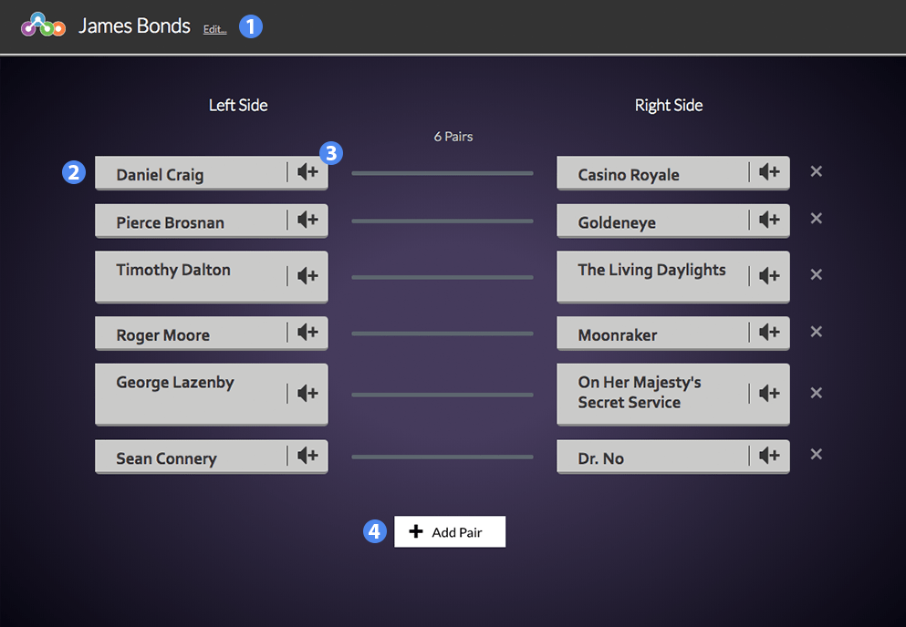

# Last Chance Cadet #

Last Chance Cadet is a fun, space-themed variation of Matching. Students must match the terms on the left-hand side with the correct corresponding term on the right-hand side.

1. Title of the widget
2. Row of matching terms
3. Optionally add an audio file to the term
4. Add a new matching pair

## Details ##

When you add a new pair, the term on the left should be matched to the term on the right. The ordering of terms will be randomized when a student interacts with the widget.