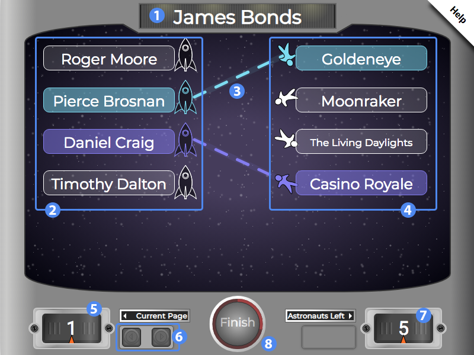

# Overview #

Last Chance Cadet is a fun, space-themed variation of Matching. Students must match the terms on the left-hand side with the correct corresponding term on the right-hand side.

1. Title of the widget
2. Left-hand terms
3. dotted line indicating a matched pair
4. Right-hand terms
5. Current page indicator
6. Pagination controls
7. Remaining astronauts (terms) to be matched
8. Finish button

## Details ##

### Matching ###

Click a term on the left or right and click a corresponding term on the other side to match the two terms, represented by matching an astronaut with their rocket ship.

If the widget has more than five pairs to match, those pairs will be sorted across more than one page. The page indicator displays your current page, and the buttons next to it allows you to paginate forwards or backwards. The indicator on the right displays the number of pairs remaining to be matched.

### Submitting ###

When you've matched every astronaut, the **Astronauts Left counter** will be set to 0 and the **Finish button** will flash red. Click the **Finish button** to submit your matches and review your performance.